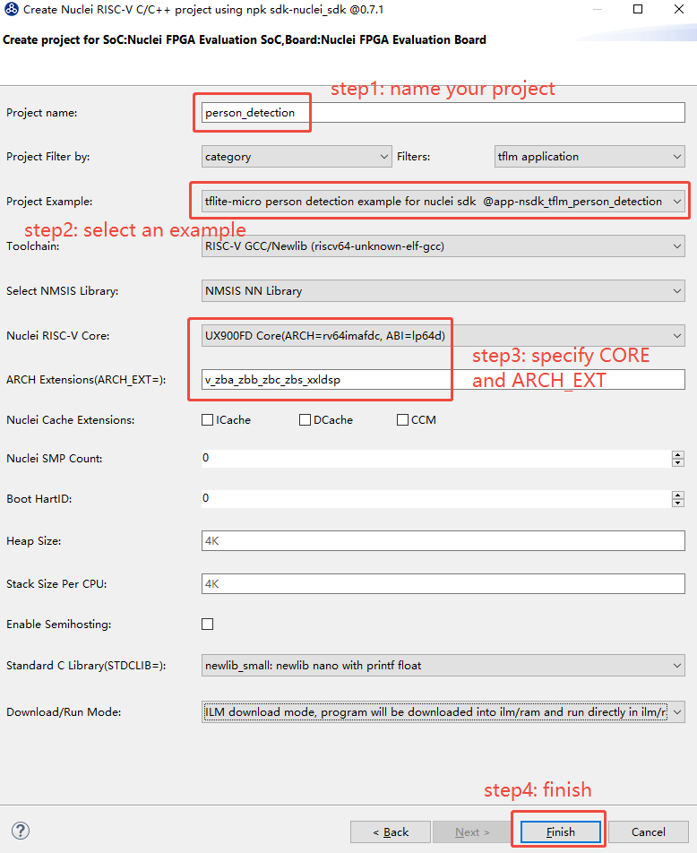

# TFLM Ported To Nuclei Platform

TensorFlow Lite for Microcontrollers (TFLM)  is a port of TensorFlow Lite designed to run machine learning models on DSPs, microcontrollers and other devices with limited memory.

Nuclei  have optimized kernel implementations and run the TFLM examples using software emulation or FPGA board.

## Introduction of Nuclei TFLM

TFLM  has been ported to Nuclei platform, you can download the source code from website:

~~~shell
git clone https://github.com/Nuclei-Software/tflm.git
~~~

TFLM has four examples that help to demonstrate how tflm works:

~~~sh
tflm/examples$ ls
hello_world  magic_wand  micro_speech  person_detection
~~~

Here are two ways to use nuclei TFLM component:

1. Use terminal
2. Use Nuclei Studio IDE

## Use TFLM in Terminal

1. Get Nuclei subsystem SDK

2. Get **tflm** zip package from https://github.com/Nuclei-Software/tflm, unzip it and put under  the *Components* folder of **$NUCLEI_SDK_ROOT**.

   ~~~shell
   nuclei-sdk$ tree -L 2
   .
   ├── application
   │   ├── baremetal
   │   ├── freertos
   │   ├── rtthread
   │   └── ucosii
   ├── Build
   │   ├── gmsl
   │   ├── Makefile.base
   │   ├── Makefile.components
   │   ├── Makefile.conf
   │   ├── Makefile.core
   │   ├── Makefile.files
   │   ├── Makefile.misc
   │   ├── Makefile.rtos
   │   ├── Makefile.rules
   │   └── Makefile.soc
   ├── Components                   # Put tflm here
   │   └── tflm
   ├── doc
   │   ├── Makefile
   │   ├── requirements.txt
   │   └── source
   ├── LICENSE
   ├── Makefile
   ├── NMSIS
   │   ├── build.mk
   │   ├── Core
   │   ├── DSP
   │   ├── Library
   │   ├── NN
   │   └── npk.yml
   ├── NMSIS_VERSION
   ├── npk.yml
   ....
   ~~~

3. Setup Tools and Environment, you can refer to https://doc.nucleisys.com/nuclei_sdk/quickstart.html# for details.

4. Build and run application.

   Assume that you will run application on Nuclei nx900fd demosoc.

   **run qemu (software emulation):**

   ~~~~shell
   cd Components/tflm/examples/xxx
   make SOC=demosoc CORE=nx900 DOWNLOAD=ilm all
   make SOC=demosoc CORE=nx900 DOWNLOAD=ilm run_qemu
   ~~~~

   **run on FPGA Board:**

   You need have correct FPGA Board and bitstream (contact Nuclei AE)

   Configured the board and Open UART terminal （ default UART baudrate  is `115200`）on your PC，then download the executable file

   ~~~shell
   cd Components/tflm/examples/xxx
   make SOC=demosoc CORE=nx900 DOWNLOAD=ilm all
   make SOC=demosoc CORE=nx900 DOWNLOAD=ilm upload
   ~~~

   then，you can get the result in terminal.

   Here is the result of tflm/examples/magic_wand.

   ~~~log
   Nuclei SDK Build Time: Apr 26 2023, 16:14:39
   Download Mode: ILM
   CPU Frequency 100610539 Hz
   CPU HartID: 0
   RING:
             *
          *     *
        *         *
       *           *
        *         *
          *     *
             *

   RING:
             *
          *     *
        *         *
       *           *
        *         *
          *     *
             *

   RING:
             *
          *     *
        *         *
       *           *
        *         *
          *     *
             *
   ~~~

## Use TFLM in Nuclei Studio IDE

1. Get Nuclei subsystem SDK

2. Download Nuclei Studio IDE from https://www.nucleisys.com/download.php, please refer to https://www.nucleisys.com/upload/files/doc/nucleistudio/Nuclei_Studio_User_Guide_202212.pdf to get the detailed usage of Nuclei Studio IDE.

3. Go to the Nuclei Package Management page to import the zip package of the subsystem SDK until the Status is installed, you need to make sure that only one version of Nuclei SDK is installed and the version of SDK should bigger than 0.4.0

   

4. Import the zip package of **tflm** until the Status is installed:

   

5. Create a new Nuclei RISC-V C/C++ Project.

   - Choose the SoC, board and SDK, you need to select the SDK corresponding to the SoC of the current subsystem.

     

   - Use Filters to filter the keyword tflm to quickly find the example you want to run, and then set the configuration items and click Finish, you should configure it as follows:

     

     **Note:** If you meet memory overflow error when building project, you could use DDR download mode that will meet memory requirement.

     The memory usage of four examples is shown as follows:

     ~~~Note
     Linking    :  hello_world.elf
        text    data     bss     dec     hex filename
      369854   57109    4984  431947   6974b hello_world.elf

     Linking    :  magic_wand.elf
        text    data     bss     dec     hex filename
      101434   45989   67192  214615   34657 magic_wand.elf

     Linking    :  micro_speech.elf
        text    data     bss     dec     hex filename
      108122   47661   19544  175327   2acdf micro_speech.elf

     Linking    :  person_detection.elf
        text    data     bss     dec     hex filename
       90386  324365  144920  559671   88a37 person_detection.elf
     ~~~

6. Build and run application.

   - If you want to build your application, you can easily click build icon:

     

   - If you want to run your application, you can easily click run icon:

     
