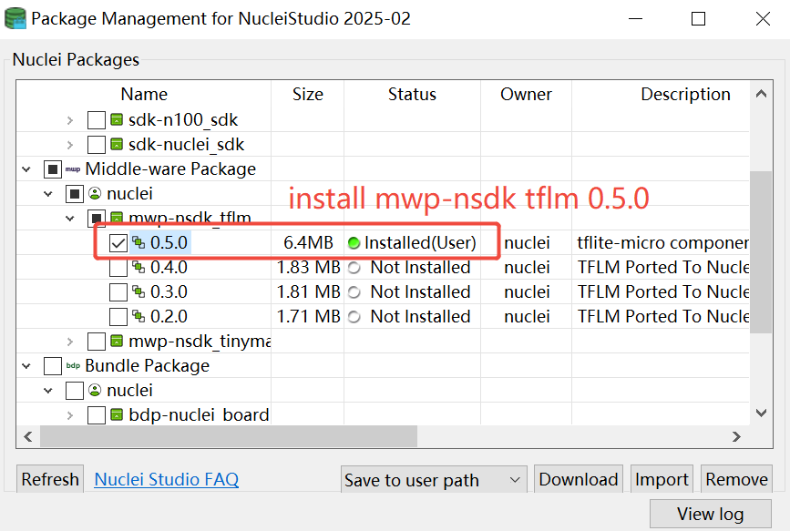

# TFLM Ported To Nuclei RISC-V Processor

TensorFlow Lite for Microcontrollers (TFLM)  is a port of TensorFlow Lite designed to run machine learning models on DSPs, microcontrollers and other devices with limited memory.

Nuclei have optimized kernel implementations(main p/v extension) and run the TFLM examples using software emulation or FPGA board.

## Introduction of Nuclei Optimized TFLM

TFLM has been ported to Nuclei RISC-V Processor and Nuclei SDK, you can evaluate it in Nuclei SDK and also in official TFLM build system.

- If you want to use it in directly TFLM build system, please check this repo https://github.com/Nuclei-Software/tflite-micro/tree/nuclei/nsdk_0.4.1
- If you want to use it in Nuclei SDK or Nuclei Studio as a software component, you can follow the following steps:

**Here are two ways to use Nuclei SDK TFLM component:**

1. Use Nuclei SDK in terminal
2. Use Nuclei Studio IDE

### Use TFLM in Terminal

1. Get Nuclei SDK (v0.4.1) from https://github.com/Nuclei-Software/nuclei-sdk/releases/tag/0.4.1

2. Get **tflm** zip package from https://github.com/Nuclei-Software/npk-tflm, unzip it and put under  the *Components* folder of **$NUCLEI_SDK_ROOT**.

   ~~~shell
   nuclei-sdk$ tree -L 2
   .
   ├── application
   │   ├── baremetal
   │   ├── freertos
   │   ├── rtthread
   │   └── ucosii
   ├── Build
   │   ├── gmsl
   │   ├── Makefile.base
   │   ├── Makefile.components
   │   ├── Makefile.conf
   │   ├── Makefile.core
   │   ├── Makefile.files
   │   ├── Makefile.misc
   │   ├── Makefile.rtos
   │   ├── Makefile.rules
   │   └── Makefile.soc
   ├── Components                   # Put tflm here
   │   └── tflm                     # Make sure structure like this tflm/examples
   ├── doc
   │   ├── Makefile
   │   ├── requirements.txt
   │   └── source
   ├── LICENSE
   ├── Makefile
   ├── NMSIS
   │   ├── build.mk
   │   ├── Core
   │   ├── DSP
   │   ├── Library
   │   ├── NN
   │   └── npk.yml
   ├── NMSIS_VERSION
   ├── npk.yml
   ....
   ~~~

3. Setup Tools and Environment, details can refer to https://doc.nucleisys.com/nuclei_sdk/quickstart.html.

4. Build and run application.

   Assuming that run application on Nuclei nx900fd evalsoc.

   **run qemu (software emulation):**

   ~~~~shell
   cd Components/tflm/examples/xxx
   make SOC=evalsoc CORE=nx900fd DOWNLOAD=ilm clean
   make SOC=evalsoc CORE=nx900fd DOWNLOAD=ilm all
   make SOC=evalsoc CORE=nx900fd DOWNLOAD=ilm run_qemu

   # select ARCH_EXT, for example, p, v, pv，use pure c version if not select ARCH_EXT
   ## p: p extension present
   ## v: v extension present
   ## pv: p and v extension present
   make SOC=evalsoc CORE=nx900fd ARCH_EXT=pv DOWNLOAD=ilm all
   make SOC=evalsoc CORE=nx900fd ARCH_EXT=pv DOWNLOAD=ilm run_qemu
   ~~~~

   **run on FPGA Board:**

   Correct FPGA Board and bitstream (contact Nuclei AE) should be prepared.

   Configure the board and open UART terminal (the default UART baudrate is `115200`)，then download the executable file.

   ~~~shell
   cd Components/tflm/examples/xxx
   make SOC=evalsoc CORE=nx900fd DOWNLOAD=ilm clean all
   make SOC=evalsoc CORE=nx900fd DOWNLOAD=ilm upload
   ~~~

   Then, result will be printed in the terminal.

   Here take the tflm/examples/person_detection as an example.

   ~~~log
   Nuclei SDK Build Time: May 26 2023, 11:05:15
   Download Mode: ILM
   CPU Frequency 999999078 Hz
   CPU HartID: 0
   person score:-72 no person score 72
   person score:-72 no person score 72
   person score:-72 no person score 72
   person score:-72 no person score 72
   person score:-72 no person score 72
   person score:-72 no person score 72
   person score:-72 no person score 72
   person score:-72 no person score 72
   person score:-72 no person score 72
   person score:-72 no person score 72
   person score:-72 no person score 72
   person score:-72 no person score 72
   person score:-72 no person score 72
   person score:-72 no person score 72
   person score:-72 no person score 72
   person score:-72 no person score 72
   person score:-72 no person score 72
   person score:-72 no person score 72
   ~~~

**FAQs: Default ilm/dlm size in evalsoc is 64K/64K, need to change it to 512K to run these cases **

If you met issue like this: `section \`.text' will not fit in region `ilm'`, this is caused by ilm size is not big enough to store the code, 64K is not enough to run this application, please use 512K, if you want to run on hardware, please make sure your hardware configured with 512K ILM/DLM.

```shell
# file: /path/to/nuclei_sdk/SoC/evalsoc/Board/nuclei_fpga_eval/Source/GCC/gcc_evalsoc_ilm.ld
# Partial as follows:

OUTPUT_ARCH( "riscv" )

ENTRY( _start )

MEMORY
{
  ilm (rxa!w) : ORIGIN = 0x80000000, LENGTH = 512K  /* change 64K to 512K */
  ram (wxa!r) : ORIGIN = 0x90000000, LENGTH = 512K  /* change 64K to 512K */
}
```

### Use TFLM in Nuclei Studio IDE

1. Download Nuclei Studio IDE from https://www.nucleisys.com/download.php,

   > Refer to the [Nuclei IDE User Guide](https://www.nucleisys.com/upload/files/doc/nucleistudio/Nuclei_Studio_User_Guide_202212.pdf ) if necessary.

2. Open the Nuclei Studio IDE

3. Download the zip package of Nuclei SDK,

   > Make sure that only one version of Nuclei SDK can be installed and version of the SDK should no older than version 0.4.1.

   

4. Import the zip package of **tflm**

   

5. Create a new Nuclei RISC-V C/C++ Project.

   - Choose the SoC, board and SDK, select the SDK corresponding to the SoC of the current subsystem.

     

   - Select the example quickly by filtering keyword "tflm" , and then set the configuration items and click Finish, configurations are as follows:

     

**Note:** If you meet memory overflow error when building project, you could use DDR download mode(evalsoc using nuclei 600/900 processor support this mode) that will meet memory requirement.

6. Build and run application.

   - Click "build" icon to build the application:

     

   - Click "run" icon to run the application:

     
