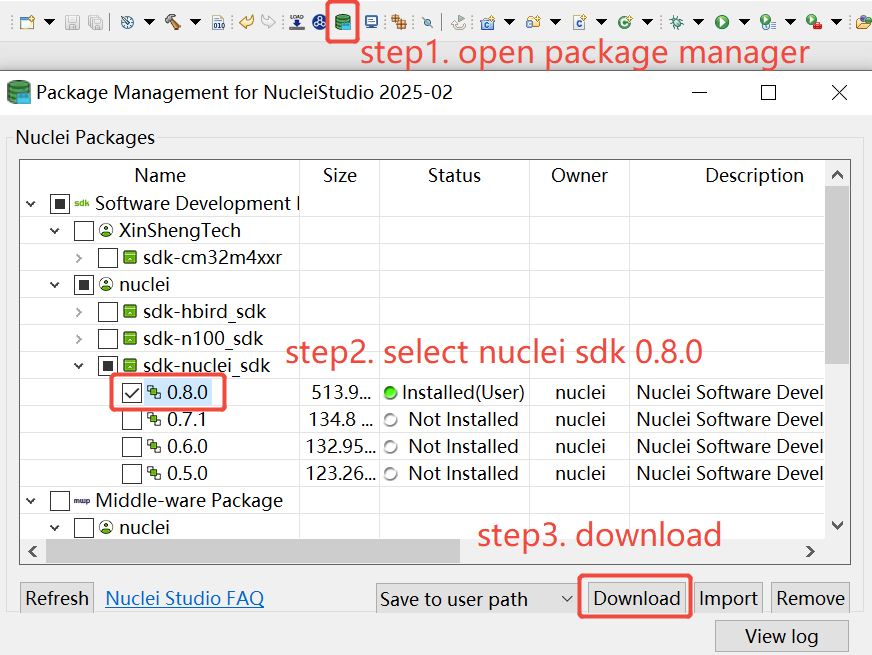
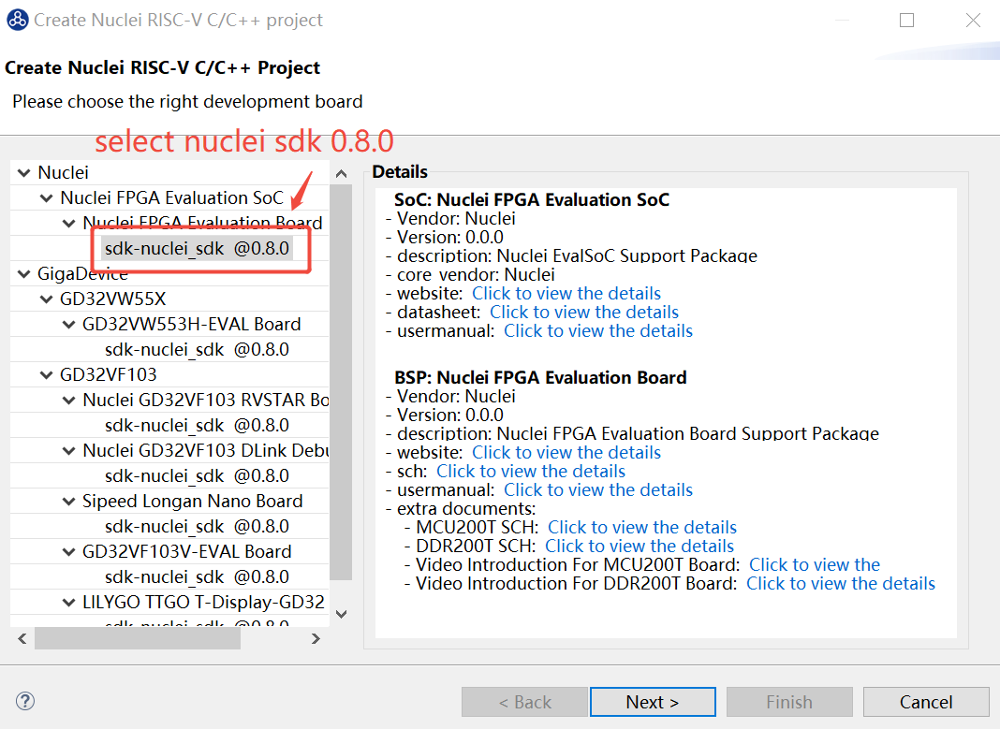
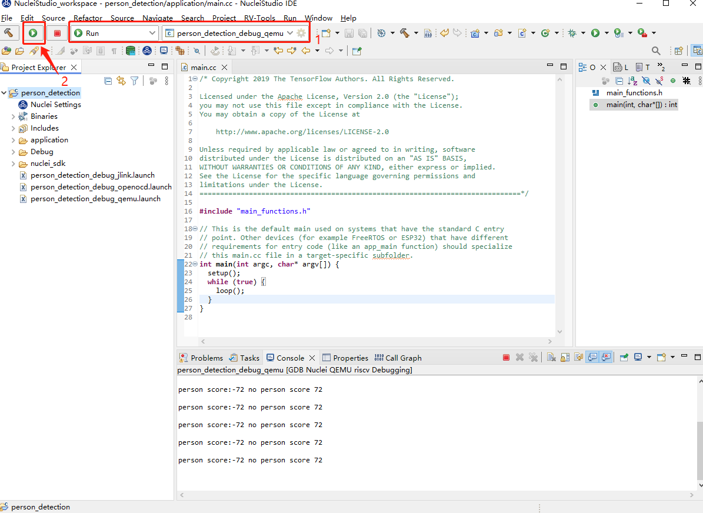

# TFLM Ported To Nuclei RISC-V Processor

TensorFlow Lite for Microcontrollers (TFLM)  is a port of TensorFlow Lite designed to run machine learning models on DSPs, microcontrollers and other devices with limited memory.

We have done TFLM NN kernel optimized implementations(main p/v extension) for Nuclei RISC-V Processor, and you can run the TFLM examples using software emulation or FPGA board.

## Introduction of Nuclei Optimized TFLM

TFLM has been ported to Nuclei RISC-V Processor and Nuclei SDK, you can evaluate it in Nuclei SDK and also in official TFLM build system.

- If you want to use it in directly TFLM build system, please check this repo: https://github.com/Nuclei-Software/tflite-micro/tree/nuclei/nsdk_0.7.1
- If you want to use it in Nuclei SDK or Nuclei Studio as a software component, you can follow the following steps:

**Here are two ways to use Nuclei SDK TFLM component:**

1. Use **Nuclei SDK 0.7.1** in terminal
2. Use **Nuclei Studio IDE 2024.06**

### Use TFLM in Terminal

1. Get Nuclei SDK (v0.7.1) from https://github.com/Nuclei-Software/nuclei-sdk/releases/tag/0.7.1

2. Get **tflm** zip package from https://github.com/Nuclei-Software/npk-tflm, unzip it and put under  the *Components* folder of **$NUCLEI_SDK_ROOT**.

   ~~~shell
   nuclei-sdk$ tree -L 2
   .
   ├── application
   │   ├── baremetal
   │   ├── freertos
   │   ├── rtthread
   │   ├── threadx
   │   └── ucosii
   ├── Build
   │   ├── gmsl
   │   ├── Makefile.base
   │   ├── Makefile.components
   │   ├── Makefile.conf
   │   ├── Makefile.core
   │   ├── Makefile.files
   │   ├── Makefile.misc
   │   ├── Makefile.rtos
   │   ├── Makefile.rules
   │   ├── Makefile.soc
   │   ├── Makefile.toolchain
   │   └── toolchain
   ├── Components
   │   ├── profiling
   │   └── tflm
   ├── doc
   │   ├── Makefile
   │   ├── requirements.txt
   │   └── source
   ├── ideprojects
   │   └── iar
   ├── LICENSE
   ├── Makefile
   ├── NMSIS
   │   ├── build.mk
   │   ├── Core
   │   ├── DSP
   │   ├── Library
   │   ├── NN
   │   └── npk.yml
   ├── NMSIS_VERSION
   ├── npk.yml
   ....
   ~~~

3. Setup Tools and Environment, details can refer to https://doc.nucleisys.com/nuclei_sdk/quickstart.html.

4. Build and run application.

   Assuming that run application on nuclei evalsoc with nx900fd cpu.

   **run qemu (software emulation):**

   ~~~~shell
   cd Components/tflm/examples/xxx
   make SOC=evalsoc CORE=nx900fd DOWNLOAD=ilm clean all run_qemu

   # select ARCH_EXT, for example, _xxldsp, v, v_xxldsp, use pure c version if not select ARCH_EXT
   ## _xxldsp: Nuclei DSP extension present
   ## v: v extension present
   ## v_xxldsp: Nuclei DSP and v extension present
   make SOC=evalsoc CORE=nx900fd ARCH_EXT=v_xxldsp DOWNLOAD=ilm all run_qemu
   ~~~~

   **run on FPGA Board:**

   Use Correct FPGA Board and bitstream(contact Nuclei AE) should be prepared(512K ILM/DLM bitstream is preferred).

   Configure the board and open UART terminal (the default UART baudrate is `115200`), then download the executable file.

   ~~~shell
   cd Components/tflm/examples/xxx
   make SOC=evalsoc CORE=nx900fd DOWNLOAD=ilm clean all upload
   ~~~

   Then, result will be printed in the terminal.

   Here take the `tflm/examples/person_detection` as an example.

   ~~~log
   Nuclei SDK Build Time: May 26 2023, 11:05:15
   Download Mode: ILM
   CPU Frequency 999999078 Hz
   CPU HartID: 0
   person score:-72 no person score 72
   person score:-72 no person score 72
   person score:-72 no person score 72
   person score:-72 no person score 72
   person score:-72 no person score 72
   person score:-72 no person score 72
   person score:-72 no person score 72
   person score:-72 no person score 72
   person score:-72 no person score 72
   person score:-72 no person score 72
   person score:-72 no person score 72
   person score:-72 no person score 72
   person score:-72 no person score 72
   person score:-72 no person score 72
   person score:-72 no person score 72
   person score:-72 no person score 72
   person score:-72 no person score 72
   person score:-72 no person score 72
   ~~~

**FAQs: Default ilm/dlm size in evalsoc is 64K/64K, need to change it to 512K to run these cases**

If you met issue like this: `section .text will not fit in region ilm`, this is caused by ilm size is not big enough to store the code, 64K is not enough to run this application,
please use 512K, **if you want to run on hardware, please make sure your cpu bitstream configured with 512K ILM/DLM**.

```shell
# file: /path/to/nuclei_sdk/SoC/evalsoc/Board/nuclei_fpga_eval/Source/GCC/evalsoc.memory
# Partial as follows:

/* ILM Memory Information */
ILM_MEMORY_PRESENT = 1;
ILM_MEMORY_BASE = 0x80000000;
ILM_MEMORY_SIZE = 0x800000;

/* DLM Memory Information */
DLM_MEMORY_PRESENT = 1;
DLM_MEMORY_BASE = 0x90000000;
DLM_MEMORY_SIZE = 0x800000;
```

### Use TFLM in Nuclei Studio IDE

1. Download Nuclei Studio IDE 2024.06 from https://www.nucleisys.com/download.php

   > Refer to the [Nuclei IDE User Guide](https://download.nucleisys.com/upload/files/doc/nucleistudio/Nuclei_Studio_User_Guide.202406.pdf) if necessary.

2. Open the Nuclei Studio IDE

3. Download the zip package of Nuclei SDK

   > Make sure the version of the SDK should be 0.7.1.

   

4. Import the zip package of **tflm**

   

5. Create a new Nuclei RISC-V C/C++ Project

   - Choose the SoC, board and SDK, select the SDK corresponding to the SoC of the current subsystem.

     

   - Select the example quickly by filtering category "tflm application", and then set the configuration items and click Finish, configurations are as follows:

     

**Note:** If you meet memory overflow error when building project, you could use DDR download mode(evalsoc using nuclei 600/900 processor support this mode) that will meet memory requirement.

6. Build and run application.

   - Click "build" icon to build the application

     

   - Click "run" icon to run the application

     
